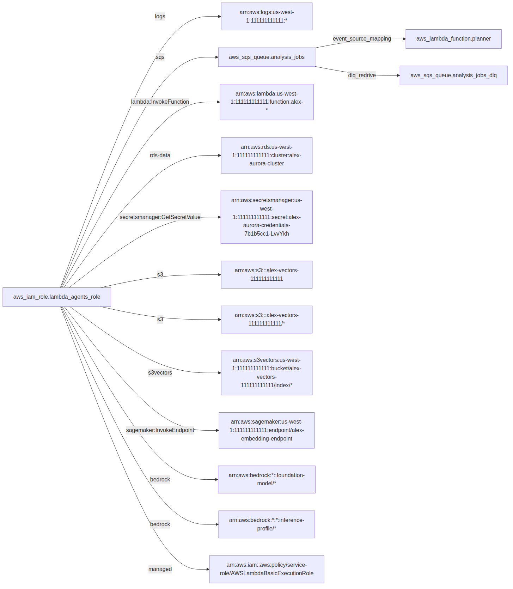

# ITest

**Terraform tells you what you declared. ITest tells you what is actually connected — and when it stops being.**

You are about to ship, or you just did, and you need to know that every
component in the system is wired to the others and running — no hand-waving,
no "it should be fine." Today that answer takes a war room, a checklist, and
someone clicking through the console. With ITest it takes minutes: one command
lists every integration your Terraform creates, one command verifies each of
them against the live account, and the result is a single line — *14 of 14
integrations passing* — that a release owner can act on. Run it before the
release, after the release, and on every CI run in between, and the first
sign of something coming unwired is a red line naming the integration, not a
page at 3 a.m.

ITest reads the Terraform you already have, extracts the integration points it
creates — the security-group rule that says *A can reach B on 5432*, the IAM
grant that says *this role may call that queue*, the event source mapping that
says *this queue drives that function* — and turns them into a tracked,
testable inventory. It follows Terraform's own rhythm: `itest plan` shows what
it found, `itest sync` writes pytest stubs and a diffable manifest, and
`itest verify` runs read-only checks against your live account and reports
coverage **per integration point**, not per test function.

It is local-first: no server, no database, nothing installed in your cloud
account. The truth lives in your repo, in a file you can read, diff, and
code-review.

## What it sees

A real production stage — 22 Terraform resources: agent Lambdas, SQS, and the
role that reaches into Aurora, SageMaker, S3, and Bedrock. Terraform sees a
list. ITest sees fourteen integration points, including the cross-stack
dependencies that no single state file describes:



Every edge in that picture is verified against the live account, read-only,
in about six seconds.

## What it catches

An event source mapping disabled by hand in the console. ITest names the
broken integration and exits 1:


That is a re-cut of a [real recording](docs/demo/alex-s6-drift-demo.cast)
against a production stack; the outputs are verbatim.

And the harder case: nothing wrong with the wiring, nothing running behind
it. On a live ALB → ECS stack, scaling the service to zero flipped exactly
two integration points red — the listener checks stayed green, because the
routing really is still declared correctly, and Terraform still saw a
perfect deployment. Excerpted from that run (`--redact` applied):

```
12 integration points: 5 passing, 2 failing, 0 errored, 5 stubs, 0 orphaned tests.
...
  [FAIL] module.alb.aws_lb_target_group.this["ex-ecs"]
           -> module.ecs_service.aws_ecs_service.this[0]
           (-> module.ecs_service.aws_ecs_service.this[0] :3000 [health /])

  AssertionError: Neither side of the blue/green pair has a healthy target.
  The service reports 0 running of 0 desired, status ACTIVE.
```

(Lines wrapped here for width; the tokens are the run's own.)

A service quietly scaled to zero is invisible to `terraform plan` and to
every config scanner. Here it is one red line with the diagnosis attached.

## Proof it works on infrastructure you did not write

Beyond its author's own systems, ITest has been run end to end — applied,
implemented by the bundled agent skill, verified green against a live account,
destroyed — on four of AWS's own
[serverless-patterns](https://github.com/aws-samples/serverless-patterns)
reference stacks and on the
[`terraform-aws-modules/ecs`](https://github.com/terraform-aws-modules/terraform-aws-ecs)
Fargate example, an ALB fronting a blue/green ECS service built entirely from
modules:

| Stack | Shape | Points | Result |
|---|---|---|---|
| terraform-sqs-lambda | 12 of 13 resources module-nested | 6 | **6/6 verified** |
| s3-sqs-lambda-terraform | S3 → SQS → Lambda, inline IAM | 6 | **6/6 verified** |
| lambda-sqs-terraform | customer-managed policy | 2 | **2/2 verified** |
| eventbridge-lambda-terraform | rule → Lambda via permission | 3 | **3/3 verified** |
| ecs-fargate-alb | ALB → blue/green pair → ECS service, 61 of 62 resources module-nested | 12 | **7/7 implemented verified** (5 wildcard-IAM stubs by choice); failure drills named a detached policy and a scaled-to-zero service exactly |

Those runs surfaced six defects — each fixed with the sample's sanitized
state as the regression fixture — plus a design finding on the ECS run: ECS
blue/green deployments rewrite listener weights and move tasks between the
target groups at runtime, so the lb_edge recipe asserts what Terraform owns
directly and the runtime split only as an invariant (weights sum to 100, at
least one side of the pair healthy). The full table, including six production
stages and the resource types ITest does **not** analyze yet, is in
[docs/compatibility.md](docs/compatibility.md) and is pinned by tests so it
cannot drift from the code.

## 60-second quickstart (no AWS needed)

Everything below runs against a checked-in `terraform show -json` fixture.

```sh
git clone https://github.com/mikemalloy/itest.git && cd itest
python -m venv .venv && source .venv/bin/activate
pip install -e .
```

**Plan** — see what ITest detects:

```sh
itest plan --tf-json tests/fixtures/simple-web-app-plan.json
```

```
ITest plan: 3 new, 0 unchanged, 0 orphaned test(s).

New integration points (3):
  + [tcp:443 ingress] 0.0.0.0/0 -> aws_security_group.alb
      id=7a05510a0b6c  hcl=aws_security_group.alb.ingress[0]
  + [tcp:80 ingress] aws_security_group.alb -> aws_security_group.web
      id=f78fd45c158f  hcl=aws_security_group_rule.web_from_alb
  + [tcp:5432 ingress] aws_security_group.web -> aws_security_group.db
      id=ddd86d182890  hcl=aws_security_group_rule.db_from_web

Orphan candidates (0):
  (none)

Not analyzed (6 resource(s)):
  aws_db_instance  1
  aws_instance     2
  aws_subnet       2
  aws_vpc          1
```

**Sync** — generate stubs and write the manifest:

```sh
itest sync --auto-approve --tf-json tests/fixtures/simple-web-app-plan.json
```

```
Applied: added 3 stub(s), flagged 0 orphan(s), 0 human-modified file(s) preserved.
```

This writes `itest_tests/test_sg_edges.py` (stubs are routed by point type —
`test_iam_edges.py` and `test_event_edges.py` appear as those types do) and
`.itest/manifest.yaml`, the inventory and test registry.

**Verify** — run the suite and report point coverage:

```sh
itest verify
```

```
3 integration points: 0 passing, 0 failing, 0 errored, 3 stubs, 0 orphaned tests.
Ran 3 tests in 0.18s

Points:
  [STUB] 0.0.0.0/0 -> aws_security_group.alb (tcp:443 ingress)
  [STUB] aws_security_group.alb -> aws_security_group.web (tcp:80 ingress)
  [STUB] aws_security_group.web -> aws_security_group.db (tcp:5432 ingress)
```

Replace one `pytest.skip(...)` with a real assertion and that point flips to
`[PASS]`. Or let the agent skill do it for all of them (below).

On a real project, drop `--tf-json`: `itest plan` runs `terraform show -json`
in the current directory and accepts either plan or state output. Add
`--redact` to `verify` before sharing output — it pseudonymizes account IDs
in every format. `itest redact` does the same for plan and state JSON.

## Five detectors, one graph

| Point type | What it is | Where it comes from |
|---|---|---|
| `sg_edge` | *A can reach B* on a protocol and port range | security-group rules, inline and standalone |
| `iam_edge` | *this role may call that resource* — actions ride in attributes; wildcards, broad managed policies, and cross-stack targets are flagged | inline policies, `aws_iam_role_policy`, and attachments; customer-managed policies in the same state resolve into real grants |
| `event_edge` | *this drives that* | event source mappings, SQS dead-letter redrive, Lambda permissions, S3 bucket notifications, EventBridge rule → target |
| `route_edge` | *this route reaches that handler* — unauthenticated routes are flagged `[open]` | API Gateway REST (v1) and HTTP API (v2) routes, integrations, and the Lambda behind them |
| `lb_edge` | *the load balancer serves this* — two hops, each verified on its own: listener → target group, and target group → what feeds it; empty groups and blue/green standbys are distinguished | `aws_lb_listener`(+rules), `aws_lb_target_group`(+attachments), ECS services including blue/green alternate groups |

Each detector emits typed primitives with content-hashed, stable IDs. A
resource ARN found in the same state resolves to its HCL address; anything
else stays an ARN flagged `external` — which is how a stage's dependency on
another stack's cluster becomes visible instead of vanishing. Resource types no
detector handles are counted and reported, never silently skipped.

## The agent skill

Stubs still need assertions. `skills/itest-implementer/` is a bundled agent
skill (open [Agent Skills](https://agentskills.io) format, used from Claude
Code) that reads the manifest, interviews you once, and fills every stub with
a real check against your account — one recipe per point type, under
[`references/recipes/`](skills/itest-implementer/references/recipes/).

The guardrails are the point:

- **Read-only by default.** `describe*`, `get*`, `list*`, and
  `iam:SimulatePrincipalPolicy`. Active probes need an explicit yes, and
  answering "prod" to the environment question forces read-only regardless.
- **Nothing hardcoded.** Every ARN and ID is resolved from `terraform show
  -json` at test time by a shared `conftest.py`, so tests follow the state.
- **Review before run.** You see every generated body before anything calls
  AWS.
- **A failing test is a finding.** The skill never weakens an assertion to
  get green; it asks whether the test is wrong or the infrastructure is.
- **Names and docstrings are frozen.** The docstring carries the point ID
  that maps a test back to its integration.

Install once, globally, and it is available in every project:

```sh
ln -s /path/to/itest/skills/itest-implementer ~/.claude/skills/itest-implementer
```

Then, in a project where you have run `itest sync`: *"implement the ITest
stubs"*. Add `.itest/skill-answers.yaml` to `.gitignore` — it records your
profile and region.

## How it works

**`itest plan`** reads `terraform show -json` (plan or state), runs every
detector, and diffs the result against the manifest. It prints a
Terraform-style changeset — new, unchanged, resurrected, orphan candidates,
not-analyzed counts — and writes `.itest/plan.json` and a Mermaid diagram to
`.itest/diagram.mmd`. Plan never modifies a test file or the manifest.

**`itest sync`** applies that plan: updates `.itest/manifest.yaml`, appends a
stub for each new point, and reclassifies tests whose bodies have been
implemented. It pauses for confirmation unless `--auto-approve`.

**`itest verify`** runs pytest under `itest_tests/`, maps each result to its
point, and rolls up: fail > error > pass > stub. Collection errors are
reported as errors, never mistaken for untouched stubs, and one broken module
cannot blind the rest. `--output json`, `--output junit`, `--redact`. Exit 0
green, 1 failures, 2 environment problems. On a terminal the output is
colored; piped it is byte-for-byte the plain text you see in this README —
enforced by test — and `NO_COLOR` / `--no-color` are respected.

**Ownership hashes** keep sync safe: it records each generated file's SHA-256
and, on a mismatch, appends but never rewrites or deletes a function you have
touched. **Orphans** — points that disappear from Terraform — are flagged in
the manifest, never deleted; if the point returns, its test is re-linked.

## Design decisions

**Local-first, manifest as code.** No server means one team can adopt it in
an afternoon, security review takes minutes, and the inventory only changes
when someone commits a change.

**Plan / sync mirrors Terraform.** Infrastructure engineers already think in
"show me the diff, then apply." The destructive-looking step (writing files)
gets the same explicit gate as `terraform apply`.

**Primitives before services.** Typed edges first; higher-level service
mappings and composite checks later, on top of a solid primitive layer.

**Integration points, not tests, are the unit of coverage.** "14 of 14
integrations verified" is a sentence a release owner can act on; "37 tests
passed" is not.

**Redact before share.** Raw plan and state JSON contain secrets. `itest
redact` exists so nothing leaves an environment unsanitized, and every
sanitized state in this repo passed `redact --check`.

The full record — including what is deliberately *not* built — is in
[DESIGN.md](DESIGN.md).

## What it does not do yet

Stated up front, because it is the first question anyone asks:

- **Detectors are AWS-only**, and cover security groups, IAM, event wiring,
  API Gateway routes, and load balancers. Resource-based policies (queue and
  bucket policies), CloudFront origins, the newer standalone
  `aws_vpc_security_group_*_rule` resources, and DNS are on the roadmap;
  today they appear in the not-analyzed list.
- **Checks are configuration assertions, plus first liveness.** Most checks
  prove the deployed wiring matches Terraform — the mapping exists and is
  enabled, the grant evaluates to allow — not that a message actually flowed.
  The lb_edge check goes one step further: it requires at least one healthy
  target behind the traffic-bearing group, so a scaled-to-zero or crash-looping
  service fails the run. Active probes that send a marked message and observe
  delivery are designed and next.
- **State beats plan.** In plan JSON most ARNs are "known after apply," so
  IAM resolution is weaker; run ITest against applied infrastructure.

## Roadmap

In order:

1. An active-probe library — self-cleaning, edge-shaped, opt-in per
   environment — starting with HTTP endpoints driven by the app's own
   OpenAPI document.
2. A release readiness page: one URL, one verdict, the graph, posture, and
   what changed since the last release.
3. Resource-based policy detectors (queue and bucket policies — the other
   side of an IAM edge) and the newer standalone security-group rule
   resources.
4. Parallel execution driven by the manifest's `tier` and `resource_group`
   fields (schema shipped; runner not).

## Development

```sh
pip install -e ".[dev]"
ruff check . && ruff format --check . && pytest
```

All three must pass before a change is done. Every bug fix starts with a
failing regression test. See [DESIGN.md](DESIGN.md) for the discipline and
the scope ledger.

## Contributing

The extension point is the detector interface in
[`itest/core/detectors/base.py`](itest/core/detectors/base.py): implement
`detect(plan_json) -> list[IntegrationPoint]`, declare the resource types you
handle, register in `DETECTORS`, and add a recipe so the skill can implement
your points. [`sg_edges.py`](itest/core/detectors/sg_edges.py) is the
reference implementation.

## License

[MIT](LICENSE).
