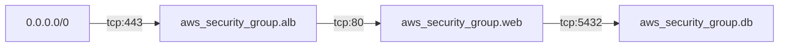

# ITest

ITest is a local-first CLI that reads your Terraform, extracts the integration
points it actually creates — for now, the security-group edges that say "A can
reach B on port N" — and turns them into a tracked, testable inventory. It
mirrors Terraform's own `plan` / `apply` rhythm: `itest plan` shows you what it
found, `itest sync` generates pytest stubs and records them in a diffable
manifest, and `itest verify` runs the suite and reports coverage at the level
of integration points, not just test functions. It is built for infrastructure
and platform engineers who want "is this connection actually tested?" to have a
real answer that lives in the repo.

## 60-second quickstart (no AWS needed)

Everything below runs against a checked-in `terraform show -json` fixture, so
you need neither AWS credentials nor a real deploy.

```sh
git clone <this-repo> && cd itest
python -m venv .venv && source .venv/bin/activate
pip install -e .
```

### 1. Plan — see what ITest detects

```sh
itest plan --tf-json tests/fixtures/simple-web-app-plan.json
```

```
ITest plan: 3 new, 0 unchanged, 0 orphaned test(s).

New integration points (3):
  + [tcp:443 ingress] 0.0.0.0/0 -> aws_security_group.alb
      id=7a05510a0b6c  hcl=aws_security_group.alb.ingress[0]
  + [tcp:80 ingress] aws_security_group.alb -> aws_security_group.web
      id=f78fd45c158f  hcl=aws_security_group_rule.web_from_alb
  + [tcp:5432 ingress] aws_security_group.web -> aws_security_group.db
      id=ddd86d182890  hcl=aws_security_group_rule.db_from_web

Orphan candidates (0):
  (none)

Not analyzed (7 resource(s)):
  aws_db_instance  1
  aws_instance     2
  aws_lb           1
  aws_subnet       2
  aws_vpc          1
```

### 2. Sync — generate stubs and write the manifest

```sh
itest sync --auto-approve --tf-json tests/fixtures/simple-web-app-plan.json
```

```
...
Applied: added 3 stub(s), flagged 0 orphan(s), 0 human-modified file(s) preserved.
```

This creates `itest_tests/test_sg_edges.py` (three skipped stubs) and
`.itest/manifest.yaml` (the inventory + test registry).

### 3. Verify — run the suite and report point coverage

```sh
itest verify
```

```
3 integration points: 0 passing, 0 failing, 3 stubs, 0 orphaned tests.

Points:
  [STUB] 0.0.0.0/0 -> aws_security_group.alb (tcp:443)
  [STUB] aws_security_group.alb -> aws_security_group.web (tcp:80)
  [STUB] aws_security_group.web -> aws_security_group.db (tcp:5432)
```

Open `itest_tests/test_sg_edges.py`, replace a `pytest.skip(...)` with a real
assertion, and run `itest verify` again — that point flips to `[PASS]`.

## The integration chain

`itest plan` also writes `.itest/diagram.mmd`. For the demo stack it is:



## How it works

**`itest plan`** reads `terraform show -json` (from `--tf-json`, or by running
terraform in the current directory), runs every detector, and diffs the result
against the existing manifest. It prints a Terraform-style changeset — new
points, unchanged points, orphan candidates, and a count of resource types no
detector analyzed — then writes the proposal to `.itest/plan.json` and the
diagram to `.itest/diagram.mmd`. **Plan never modifies a test file or the
manifest.**

**`itest sync`** consumes that plan (running one implicitly when needed),
updates `.itest/manifest.yaml`, and generates a pytest stub for each new point.
It pauses for confirmation unless you pass `--auto-approve`.

**`itest verify`** runs the pytest suite under `itest_tests/`, maps each result
back to its integration point through the manifest, and rolls the results up:
a point is **passing** if at least one of its tests passed and none failed,
**failing** if any failed, and a **stub** if it is only skipped. It supports
`--output json` and `--output junit` (writes `itest-results.xml`), and exits
non-zero when anything fails.

**The manifest** (`.itest/manifest.yaml`) is the single shared artifact: a
human-readable, diffable inventory of every detected point and the tests
registered against it. You commit it alongside your Terraform.

**Ownership hashes** are how sync stays safe. When it generates a stub it
records the SHA-256 of the test file. On the next sync, if a file's hash no
longer matches what was recorded, ITest treats it as human-modified: it will
*append* new stubs but will never rewrite or delete a function you have
touched. Your edits are never clobbered.

**The orphan policy** is deliberately conservative. When a point disappears
from the Terraform (a rule was removed), the tests that covered it are flagged
`orphaned` in the manifest — never silently deleted. You decide whether to
remove the test or the assumption behind it.

## Design decisions

**Why `plan` / `sync` mirrors Terraform.** Infrastructure engineers already
have a mental model for "show me the diff, then let me apply it." Reusing that
rhythm — a read-only proposal you inspect, then an explicit apply — means the
tool needs almost no new concepts, and it makes the destructive-looking step
(generating files) feel as safe as `terraform apply`.

**Why `path::TestClass::test_name` addressing.** Pytest's node-id syntax is the
one canonical address for a test that everything in the Python ecosystem
already understands. ITest resolves shorthand against the manifest registry
rather than parsing paths blind, and refuses to guess when input is ambiguous.

**Why local-first.** There is no server and no database. The truth lives in the
repo, in a file you can read, diff, and code-review. That makes ITest adoptable
one team at a time and keeps the manifest honest — it changes only when someone
commits a change.

**Why primitives before services.** v0.1 ships exactly one detector — the
security-group edge — and models it as a typed primitive (source, target,
protocol, ports, direction). Higher-level "service" mappings and composite
checks are far more useful once the primitive layer is solid, so the primitive
layer comes first.

## Roadmap

All of the following are **planned, not built**. v0.1 is intentionally a single
detector and three commands.

- **Detector tiers.** Tier 1 remainder: IAM edges, endpoint availability, DNS,
  and event wiring. Then composite detectors, and service mappings (e.g.
  SageMaker, App Runner) built on top of the primitives.
- **Labels & filtering** for slicing points and tests.
- **`itest add`** to declare integration points a detector can't infer.
- **`disable` / `enable`** commands for muting points with a recorded reason.
- **Saved-plan review flow** beyond the current implicit plan.
- **An agent/skill layer** over the engine.

## Contributing

The extension point is the detector interface in
[`itest/core/detectors/base.py`](itest/core/detectors/base.py): implement
`detect(plan_json) -> list[IntegrationPoint]`, declare the resource types you
handle, and register your detector in `DETECTORS`. See
[`itest/core/detectors/sg_edges.py`](itest/core/detectors/sg_edges.py) for the
reference implementation and [`DESIGN.md`](DESIGN.md) for the decisions that
bound v0.1.
